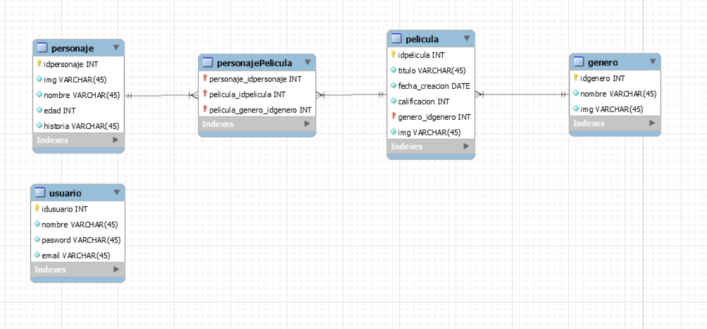

#CHALLENGE BACKEND - NodeJs 
...

##Objetivo

> Desarrollar una API para explorar el mundo de Disney, la cual permitirá conocer y modificar los
personajes que lo componen y entender en qué películas estos participaron. Por otro lado, deberá
exponer la información para que cualquier frontend pueda consumirla.
> Consignas <a href="https://drive.google.com/file/d/1XCUYgTFaE9uBNI-FqKDWIa4RCztooz_X/view"> aqui </a>

> La misma fue realizada con NodeJs , Express, Sequelize

> ##Puede encontrar toda la documentacion de la misma haciendo click <a href="https://documenter.getpostman.com/view/18828766/UVeCQTtN"> Click</a> o ingresando al siguiente link: https://documenter.getpostman.com/view/18828766/UVeCQTtN

###Base de datos utilizada, la misma fue creada con Workbench:


##Install 

//instalamos las dependencias necesarias

```sh
npm install
```

